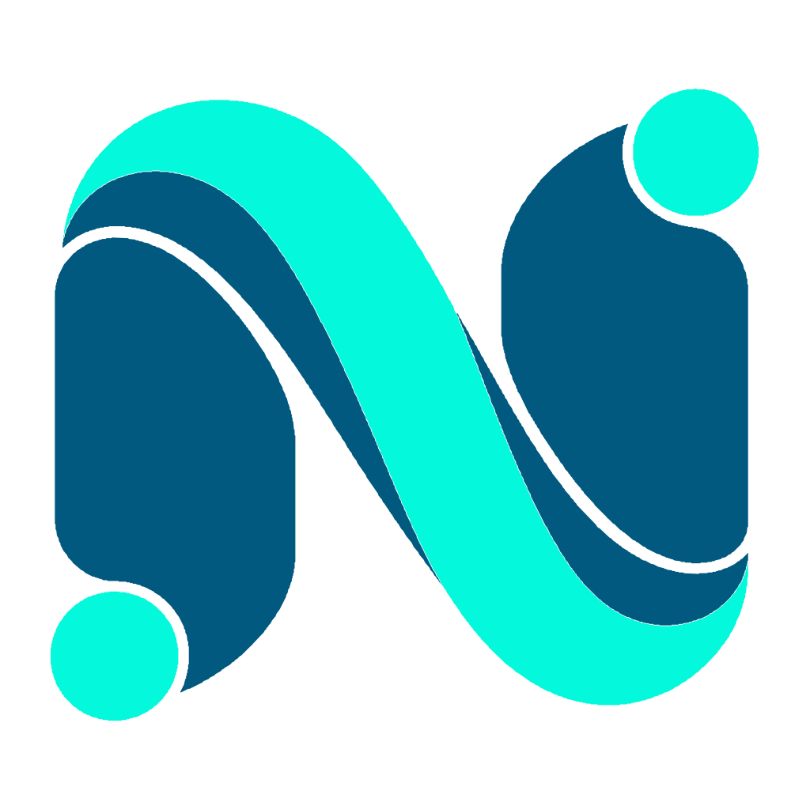
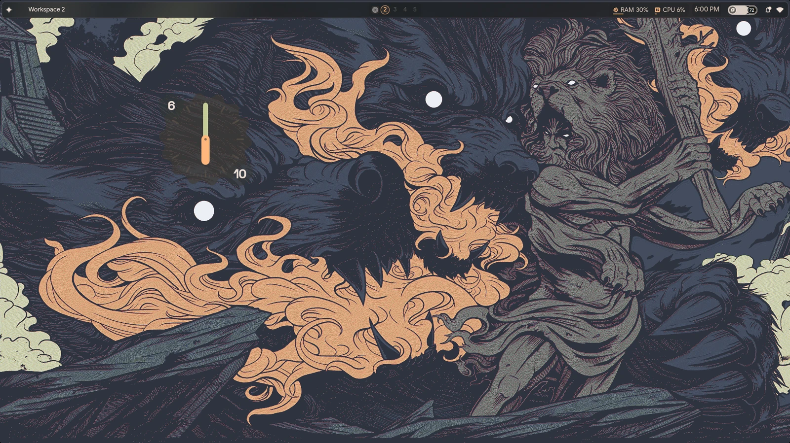
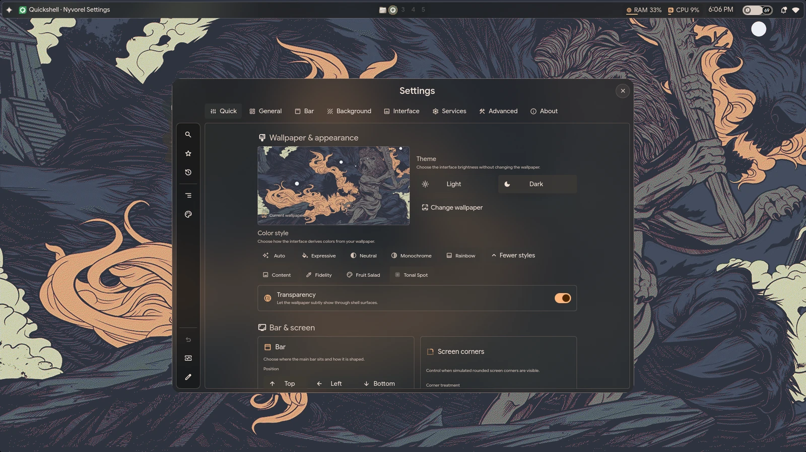
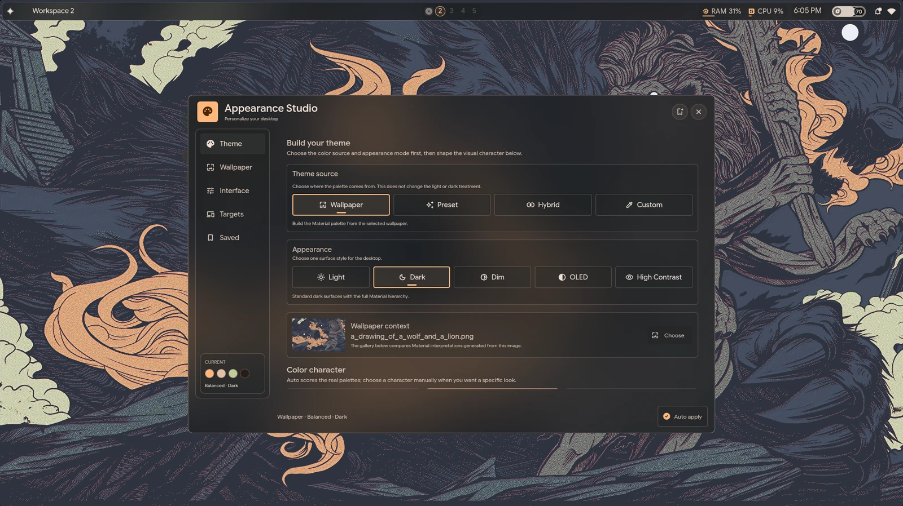
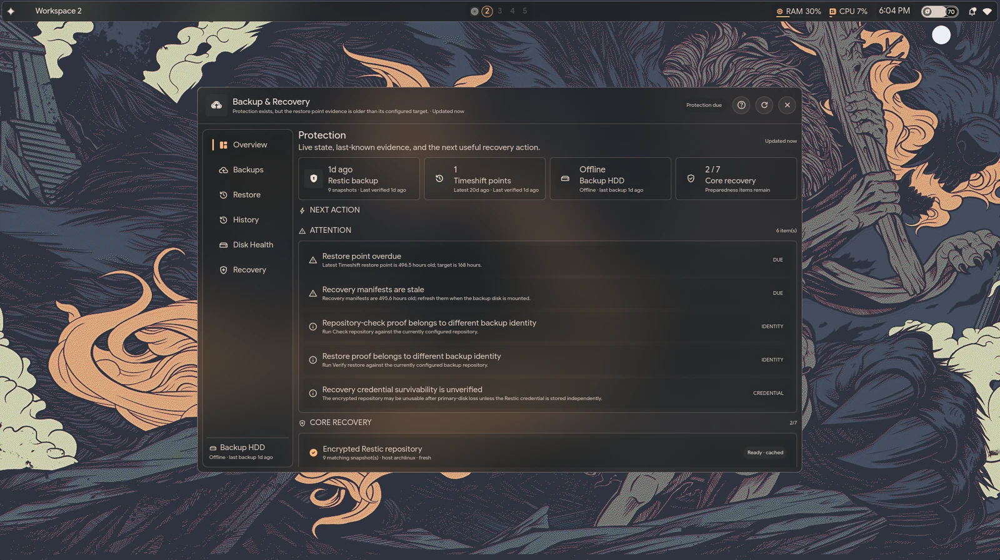
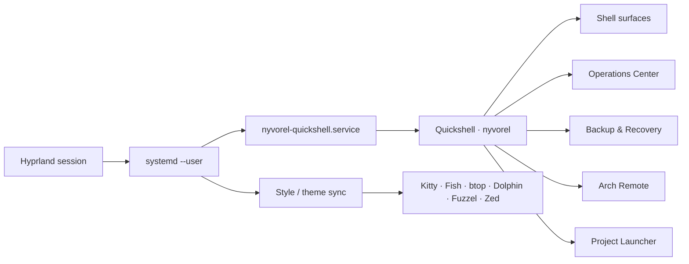

<div align="center">



# Nyvorel Shell

### A cohesive Hyprland + Quickshell desktop environment for Arch Linux.

**Fluid shell UI · integrated desktop workflows · recoverable installation · portable source**

[](https://github.com/harkoussomar/nyvorel/releases/latest)
[](./LICENSE)
[](https://github.com/harkoussomar/nyvorel/stargazers)


[**Install**](#quick-start) ·
[**Explore**](#the-nyvorel-experience) ·
[**Architecture**](#how-it-fits-together) ·
[**Documentation**](#documentation) ·
[**Release v0.1.0**](https://github.com/harkoussomar/nyvorel/releases/tag/v0.1.0)

</div>


<!-- NYVOREL_SHOWCASE_HERO_START -->
<p align="center">
  
</p>

<p align="center">
  <sub>Nyvorel running as a cohesive Hyprland + Quickshell desktop environment.</sub>
</p>
<!-- NYVOREL_SHOWCASE_HERO_END -->

---

## What is Nyvorel?

Nyvorel is a desktop shell and workflow layer built around **Hyprland** and
**Quickshell**.

It is designed as one connected environment rather than a loose collection of
dotfiles: the shell, session lifecycle, desktop services, appearance,
application integrations, recovery tooling, and user workflows are meant to
behave as parts of the same system.

Nyvorel began as a derivative of
[`end-4/dots-hyprland`](https://github.com/end-4/dots-hyprland) / Illogical
Impulse and has since been extensively redesigned with its own identity,
modules, services, UX, lifecycle model, and tooling.

> **Current stable release:** [`v0.1.0`](https://github.com/harkoussomar/nyvorel/releases/tag/v0.1.0)

## At a glance

| | |
| --- | --- |
| **Platform** | Arch Linux |
| **Compositor** | Hyprland |
| **Desktop shell** | Quickshell |
| **Service lifecycle** | systemd user services |
| **Automation / tooling** | Bash + Python |
| **Current release** | `v0.1.0` |
| **License** | GPL-3.0 |
| **Install model** | Manifest-backed, backup-first, recoverable |

## The Nyvorel experience

<table>
<tr>
<td width="50%" valign="top">

### Shell & interaction

- Quickshell-based desktop shell
- workspace and session surfaces
- notifications and on-screen display
- media controls
- appearance workflows
- project launcher
- utility and system surfaces

</td>
<td width="50%" valign="top">

### System workflows

- Operations Center
- Backup & Recovery
- Arch Remote
- managed Quickshell lifecycle
- systemd user services
- desktop-aware helpers
- recovery-oriented installation

</td>
</tr>
<tr>
<td width="50%" valign="top">

### Integrated appearance

- shared desktop styling workflows
- terminal theme synchronization
- Fish and Kitty integration
- application style synchronization
- integrations for tools such as btop, Dolphin, Fuzzel, and Zed

</td>
<td width="50%" valign="top">

### Reliability by design

- portable public source
- explicit `@HOME@` materialization
- timestamped installation backups
- machine-readable install manifests
- safe uninstall / restore
- protection for post-install user edits

</td>
</tr>
</table>


<!-- NYVOREL_SHOWCASE_GALLERY_START -->
## Showcase

Real Nyvorel surfaces running on the desktop — no mockups.

<table>
<tr>
<td width="50%" valign="top">
  
  <br />
  <sub><b>Nyvorel Settings</b> — shell behavior, wallpaper, interface and service configuration in one place.</sub>
</td>
<td width="50%" valign="top">
  
  <br />
  <sub><b>Appearance Studio</b> — wallpaper-aware palettes, appearance modes and integrated desktop styling.</sub>
</td>
</tr>
</table>

<p align="center">
  
  <br />
  <sub><b>Backup &amp; Recovery</b> — recovery readiness, backup evidence and restore health as a first-class desktop workflow.</sub>
</p>
<!-- NYVOREL_SHOWCASE_GALLERY_END -->

## Quick start

### 1. Requirements

Nyvorel `v0.1.0` targets an existing **Arch Linux + Hyprland + Quickshell**
desktop.

Core requirements are defined by the versioned dependency contract:

- [`dependencies/arch.json`](dependencies/arch.json) — machine-readable contract;
- [`DEPENDENCIES.md`](DEPENDENCIES.md) — required/optional/test-only policy.

The supported core includes Hyprland, Quickshell (`qs` or `quickshell`),
systemd user services, Python 3, Bash/GNU userland, D-Bus session integration
and Git for the safe update lifecycle.

Feature-specific applications are classified as optional. Missing optional
dependencies do not make unrelated Nyvorel functionality unsupported.

After installation, `nyvorel doctor` checks the dependency contract as part of
live-session diagnostics. Use `nyvorel doctor --no-session --dependencies` for
an explicit read-only dependency preflight outside the graphical session.

`nyvorel bootstrap` turns missing required dependencies into a read-only Arch
package plan. Run `nyvorel bootstrap --list-optional` to discover feature IDs,
then select only the features you want with `--optional ID`. Bootstrap never
installs packages or invokes an AUR helper.

### 2. Clone

```sh
git clone https://github.com/harkoussomar/nyvorel.git
cd nyvorel
```

### 3. Preview before touching your configuration

```sh
./install.sh --dry-run
```

### 4. Install

```sh
./install.sh --yes
```

To install and activate Nyvorel services in the current Hyprland / Wayland
session:

```sh
./install.sh --yes --activate
```

> The installer backs up every managed file it replaces and records the
> installation under `~/.local/state/nyvorel/installations/`.

See [`INSTALL.md`](./INSTALL.md) for the complete installation and recovery
model.

## Safe recovery is part of the install model

Nyvorel does not treat uninstall as an afterthought.

```sh
./uninstall.sh --yes
```

The recovery flow:

1. reads the installation manifest;
2. verifies managed-file checksums;
3. restores files that existed before installation;
4. removes files created by Nyvorel;
5. refuses to overwrite files you edited after installation.

When you explicitly choose forced recovery, changed files are archived first:

```sh
./uninstall.sh --yes --force-changed
```

Runtime/user state under `~/.config/nyvorel` is intentionally retained.

## Diagnose Nyvorel

Nyvorel includes a read-only doctor command for installation and session health:

```sh
nyvorel doctor
```

Use a full managed-file checksum pass when investigating drift:

```sh
nyvorel doctor --deep
```

For scripts and support reports:

```sh
nyvorel doctor --json
```

The doctor checks the installed shell/CLI, installation manifest, managed-file
integrity, install-time path materialization, runtime JSON configuration,
systemd user services, Quickshell availability, the Hyprland session, and
Hyprland configuration errors. It does not modify files or restart services.

Warnings do not change the normal exit code; `--strict` makes warnings
non-zero. `--home PATH --no-session` can inspect an alternate installation
without touching the live desktop session.

## Update safely

Nyvorel updates are manifest-aware and preserve the original pre-Nyvorel
recovery baseline instead of treating the currently installed Nyvorel files as
a new backup baseline.

Preview an update from the source checkout recorded by the current installation:

```sh
nyvorel update --dry-run
```

Fast-forward a clean recorded source checkout from `origin/main`, review the
plan, then apply:

```sh
nyvorel update --fetch --dry-run
nyvorel update --fetch --yes
```

To reload the user services after the filesystem update:

```sh
nyvorel update --fetch --yes --activate
```

If a managed file was edited or removed locally, update stops before mutation.
When you explicitly use `--force-changed`, existing edited files are archived
under the new installation state before candidate files replace them:

```sh
nyvorel update --fetch --yes --force-changed
```

You can also update from an explicitly prepared source tree:

```sh
nyvorel update --source /path/to/nyvorel --dry-run
```

The update transaction carries forward original backups, restores or removes
files that a newer source no longer manages, writes a fresh manifest, and
rolls back the filesystem and `current-install` pointer if the transaction
fails.

## How it fits together



Hyprland starts the Nyvorel session lifecycle, systemd owns long-running user
services, and Quickshell owns the primary desktop experience.

## Portability model

The public repository never embeds the maintainer's home directory.

Files that need an absolute target-user path use the source token:

```text
@HOME@
```

For `v0.1.0`, the installer materializes those templates at install time while
leaving the public source unchanged.

This gives Nyvorel a clean separation between:

```text
public source
    ↓
install-time materialization
    ↓
user-specific runtime
```

Read [`PORTABILITY.md`](./PORTABILITY.md) for the complete model.

## Repository map

```text
nyvorel/
├── quickshell/       # shell, modules, services, UI and workflows
├── hypr/             # Hyprland integration and configuration
├── systemd/          # portable user-unit templates
├── bin/              # Nyvorel helper commands
├── integrations/     # Fish / Kitty integration
├── assets/           # Nyvorel project assets
├── runtime-config/   # runtime-state boundary documentation
├── LICENSES/         # component / third-party license evidence
├── install.sh
└── uninstall.sh
```

## Documentation

| Guide | Purpose |
| --- | --- |
| [`INSTALL.md`](./INSTALL.md) | installation, activation, backup, uninstall, and recovery |
| [`PORTABILITY.md`](./PORTABILITY.md) | source portability and `@HOME@` materialization |
| [`CONTRIBUTING.md`](./CONTRIBUTING.md) | contribution workflow and source boundaries |
| [`CHANGELOG.md`](./CHANGELOG.md) | public release history |
| [`PROVENANCE.md`](./PROVENANCE.md) | upstream and source provenance |
| [`INHERITED_ASSETS.md`](./INHERITED_ASSETS.md) | inherited asset policy |
| [`THIRD_PARTY_NOTICES.md`](./THIRD_PARTY_NOTICES.md) | third-party notices |
| [`TRADEMARKS.md`](./TRADEMARKS.md) | trademark and affiliation notices |

A dedicated Nyvorel documentation website is planned as the project grows.

## Project direction

`v0.1.0` establishes the public source, release model, portability boundary,
installer, and recovery lifecycle.

Next focus areas include:

- richer visual showcase and project website;
- complete user and technical documentation;
- automated release and installer validation;
- clean-machine installation testing;
- packaging and distribution improvements.

## Contributing

Contributions are welcome.

Please read [`CONTRIBUTING.md`](./CONTRIBUTING.md) before opening a pull request,
especially when adding third-party code or assets.

## Upstream, licensing & attribution

Nyvorel is distributed under **GPL-3.0** as a substantially modified derivative
of [`end-4/dots-hyprland`](https://github.com/end-4/dots-hyprland).

Upstream attribution, component licensing, inherited-asset documentation, and
third-party notices are intentionally preserved.

See:

- [`LICENSE`](./LICENSE)
- [`NOTICE.md`](./NOTICE.md)
- [`PROVENANCE.md`](./PROVENANCE.md)
- [`THIRD_PARTY_NOTICES.md`](./THIRD_PARTY_NOTICES.md)
- [`INHERITED_ASSETS.md`](./INHERITED_ASSETS.md)
- [`TRADEMARKS.md`](./TRADEMARKS.md)
- [`LICENSES/`](./LICENSES/)

Third-party names, logos, and marks remain the property of their respective
owners. Nyvorel is an independent community project and is not affiliated with
or endorsed by the third parties represented by those assets.

---

<div align="center">

**Nyvorel Shell**

Built around Hyprland. Shaped into its own system.

[Latest release](https://github.com/harkoussomar/nyvorel/releases/latest)
·
[Changelog](./CHANGELOG.md)
·
[Contributing](./CONTRIBUTING.md)

</div>

### Clean-machine regression

CI also validates Nyvorel from a pristine Arch Linux container using a brand-new non-root home. The regression covers installation, manifest confinement, template materialization, the installed CLI and Doctor, non-mutating update planning, and recovery.
